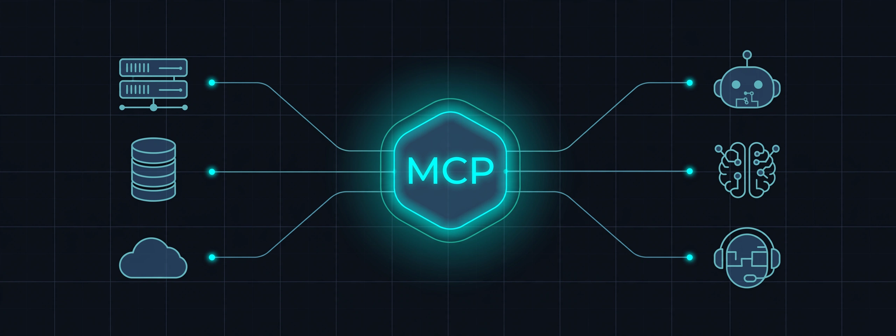

<div align="center">
  
</div>

# MCP Gateway

[](https://nodejs.org)
[](https://www.typescriptlang.org)
[](https://fastify.dev)
[](tests/)
[](LICENSE)

A managed gateway for [Model Context Protocol](https://modelcontextprotocol.io) servers. Register MCP servers once, then let many agents share them through one endpoint with API-key auth, per-tenant scopes, rate limiting, guardrails, and full audit logging.

## How it works

```
 agents                     gateway                          upstream MCP servers
┌──────┐  POST /mcp          ┌──────────────┐  stdio / SSE    ┌──────────────┐
│agent │ ──────────────────► │  auth, scope │ ──────────────► │ calc (stdio) │
│agent │  tools/list,call    │  rate limit  │  multiplexed    ├──────────────┤
│agent │ ◄────────────────── │  guardrails  │  shared conns   │ notes (stdio)│
└──────┘  qualified tools    │  audit log   │                 └──────────────┘
         calc__add, …       └──────────────┘
```

The gateway presents itself as a single MCP server. Tools are namespaced by
upstream (`calc__add`), so clients discover and call everything through one
`tools/list` / `tools/call` surface.

## Quickstart

```bash
npm install
export MCP_GW_ADMIN_TOKEN="pick-a-secret"
npm run build
node dist/index.js
```

Register the bundled demo servers and mint a key:

```bash
ADMIN=(-H "Authorization: Bearer pick-a-secret" -H "Content-Type: application/json")

curl "${ADMIN[@]}" -d '{"name":"calc","transport":{"type":"stdio","command":"node","args":["demo-servers/calc.ts"]}}' \
  localhost:8080/admin/servers

KEY=$(curl -s "${ADMIN[@]}" -d '{"name":"agent-1","servers":["*"]}' \
  localhost:8080/admin/keys | python3 -c "import json,sys; print(json.load(sys.stdin)['secret'])")

curl -H "Authorization: Bearer $KEY" -H "Content-Type: application/json" \
  -d '{"jsonrpc":"2.0","id":1,"method":"tools/call","params":{"name":"calc__add","arguments":{"a":40,"b":2}}}' \
  localhost:8080/mcp
# {"jsonrpc":"2.0","id":1,"result":{"content":[{"type":"text","text":"42"}]}}
```

Or run the full scripted tour (build, register, call, denied call, rate limit, audit):

```bash
./scripts/demo.sh
```

## Features

- **Upstream registry**: register stdio and SSE MCP servers; the gateway runs the `initialize` handshake and caches the tool catalog. One shared connection per server, multiplexed across clients.
- **Auth and scopes**: API keys with per-tenant server scopes (`["calc"]` or `["*"]`) and optional tool-level allowlists. Secrets are sha256-hashed at rest, shown once at creation.
- **Rate limiting**: per-key token buckets with optional per-key overrides; `x-ratelimit-remaining` on every response.
- **Guardrails**: gateway-wide tool deny patterns, max argument size, per-call timeouts, max output size.
- **Audit and stats**: every call (including denials and 429s) lands in a JSON-lines audit log and an in-memory ring for the live dashboard; per-tool/per-tenant counters for usage charts.
- **Admin API**: manage servers, keys, stats, and logs under `/admin` (bearer token).
- **Dashboard**: React UI for servers, tool catalog, live request log, usage charts, and key management. Served by the gateway when `dashboard/dist` exists.

## API surface

| Endpoint | Auth | Description |
|---|---|---|
| `POST /mcp` | API key | JSON-RPC: `initialize`, `tools/list`, `tools/call`, `ping` |
| `GET /healthz` | none | Liveness probe |
| `GET/POST/DELETE /admin/servers` | admin token | Upstream registry |
| `GET/POST/DELETE /admin/keys` | admin token | API key management |
| `GET /admin/tools` | admin token | Aggregated tool catalog |
| `GET /admin/stats` | admin token | Usage counters |
| `GET /admin/logs` | admin token | Recent audit entries |

Tool calls return gateway error codes in the `-3200x` range: `-32001` upstream
timeout, `-32002` upstream unavailable, `-32003` rate limited, `-32004`
unauthorized, `-32005` forbidden, `-32006` guardrail violation.

## Configuration

| Variable | Default | Description |
|---|---|---|
| `MCP_GW_ADMIN_TOKEN` | (required) | Bearer token for `/admin` |
| `MCP_GW_PORT` / `MCP_GW_HOST` | `8080` / `127.0.0.1` | Listen address |
| `MCP_GW_CALL_TIMEOUT_MS` | `30000` | Per tool-call timeout |
| `MCP_GW_MAX_ARGS_BYTES` | `65536` | Max tool arguments size |
| `MCP_GW_MAX_OUTPUT_BYTES` | `262144` | Max upstream output size |
| `MCP_GW_RL_CAPACITY` / `MCP_GW_RL_REFILL` | `60` / `1` | Default token bucket |
| `MCP_GW_LOG_DIR` | `logs` | Audit log directory |

## Development

```bash
npm test          # vitest, 37 tests
npm run typecheck # tsc --noEmit
npm run build     # emit to dist/
```

Docker (compose file included; images not built here):

```bash
MCP_GW_ADMIN_TOKEN=secret docker compose up --build
```

## Layout

```
src/            gateway: proxy, admin api, registry, auth, limits, audit
  transports/   stdio and SSE JSON-RPC transports
demo-servers/   calculator and notes MCP servers used by the demo
dashboard/      react admin UI (served from / when built)
tests/          37 vitest tests
scripts/demo.sh end-to-end demo against real local processes
```

## License

MIT
